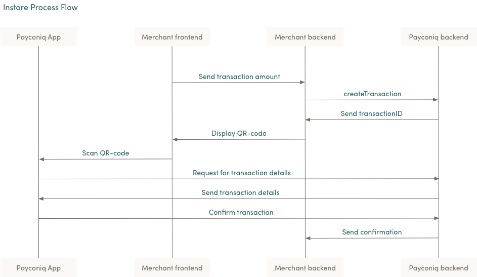

# WooCommerce Payconiq
  
WooCommerce Payconiq enables the Payconiq payment method for WooCommerce.

## Payconiq
Payconiq simplifies mobile payments in stores, online and between friends in a world that has become increasingly digital. Payconiq is committed to digitizing and simplifying the payment landscape. Payconiq is able to execute payments quickly and effectively because it maintains a relationship with both the consumer (the app user) and the merchant or partner. More information about Payconiq can be found [here](https://dev.payconiq.com/online-payments-dock/).

## Accept payconiq directly at your store
This complete payment solution enables store owners to accept Payconiq payments using one simple signup flow for activation. An easy setup has you up and running quickly. Customers can complete their purchase without leaving your online store.

## Getting Started
In order to get started, the following activities and necessary access will be arranged between you and Payconiq.

## Merchant Onboarding
This is the process of setting up merchants on the Payconiq platform in order to interact with the API endpoints. As part of the onboarding process, you will receive a generated unique Merchant Identifier and an API key which will be used when interacting with the Payconiq endpoints. This will be shared via mail.

## Environments
There are two environments where merchants and partners are exposed to. The External Environment (EXT) and the Production Environment (PROD).

### External Environment
This is a pre-production environment where all tests and integration work are carried out. We recommend a sign off is granted on this environment before moving to the production environment. All tests performed with the test accounts never hit the production or real banking environment.

### Production Environment
This is the environment where real transactions take place. Once onboarded and transactions take place, please note that app user accounts will be debited, and merchant accounts will be credited.

## Process flow
Involved Parties:

* Payconiq App – Payconiq consumer application.
* Merchant Frontend – POS terminal or Customer facing display.
* Merchant Backend – Backend of merchant that integrates and interacts with Payconiq.
* Payconiq Backend – Backend of Payconiq that provides integration and payment services.

#### Step by step transaction flow

* Merchant frontend sends transaction creation details to Merchant’s backend. This will contain at least the transaction amount.
* Merchant backend sends a REST request to the Payconiq backend to create a transaction. The parameters passed in this request are the transaction amount, transaction currency, transaction description and a callback url.
* Payconiq backend sends a create transaction response with the Payconiq transaction id to the Merchant backend.
* The Merchant backend sends the transaction id to the Merchant frontend to display the payment as a QR code.
* Payconiq App scans the QR code in order to start the payment for the amount displayed. A request for transaction details is sent to the Payconiq backend for the transaction.
* Payconiq backend sends the transaction details to the Payconiq App which would contain the name of the merchant and the amount to pay.
* The user confirms the payment by entering his/her pin. A payment transaction request is sent to the Payconiq Backend for authorization.
* A payment transaction response with the details is sent back to the Payconiq App indicating a success or failure of the transaction.
* Payconiq backend sends a payment transaction notification to the Merchant backend with the transaction details via the callbackURL. The details of the notification will either contain success or failure details.